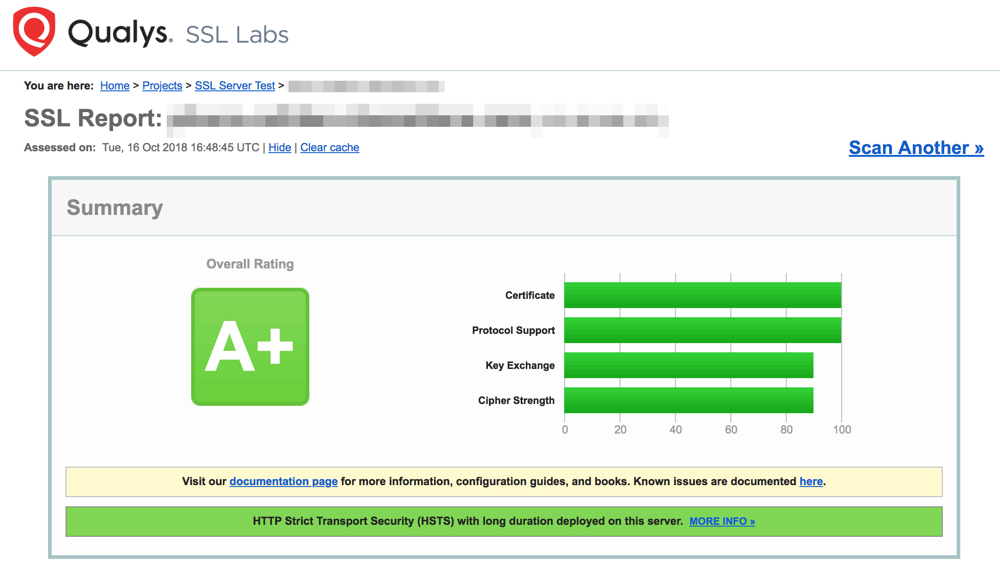

# Nginx Config

I really love [nginx](https://nginx.org) for it's simplicity, versatility, and
performance. It doesn't take much to build some pretty powerful stuff with it.

This is a sample nginx config which demonstrates a number of useful settings for
using it as both a static file server and/or a reverse proxy (and semi-load balancer) to
1 or more server applications. I've put this here mostly for my own reference,
but that doesn't mean it can't be a good reference for you too :)

## App Specificity

The idea is to have one `app-specific.conf` file, with a singular `server`
block, per website/app which is being controlled by nginx. These settings are
different from the global settings found in the main `nginx.conf` file and
should be tailored to the needs of your website/app.

NOTE: what I mean by "app specific config" is a config file that would live in
`/etc/nginx/sites-available` which you would link to from
`/etc/nginx/sites-enabled`. The main `nginx.conf` will automatically load
anything that's in `sites-enabled` by `include`ing it.

## Docker

You may alternatively want to create a [Docker](https://www.docker.com/) image
to encapsulate your whole nginx environment and maybe use it as a microservice
amongst some other containers. For example, I've used this method to create a
nginx front-end to act as a simple load-balancer, reverse proxy, and SSL
terminator that connects a number of other back-end service containers and to
serve some static content such as documentation.

In this scenario, because the environment is greatly simplified and singular
(the entire system is *only* for running nginx), I would opt for combining the
above app-specific config file with the main `nginx.conf` since it likely will
only be doing that one thing ;)

## Reverse Proxy

I find that using nginx in front of my (in my case, Nodejs) applications is a
really great (read: feature-rich, performant, and easy-to-setup) solution for
handling low to decently-sized loads that helps me hit the ground running. When
I have later proven my app to be successful, and as it develops resource
requirements  which can no longer be handled by simple vertical scaling
techniques, I can then implement a more sophisticated, automated, horizontal
scaling solution (e.g., a la kubernetes/docker variety). But when I'm just
starting a new project, proving an MVP, or deploying something that isn't
intended for mass bandwidth, using nginx as my server's frontend is just about
right.

## SSL



Nginx can handle terminating SSL/TLS connections and then (behind nginx) use a plain
http connection to the application (this connection is internal, so it should be
secured by the host's network security). The application itself will have no
outside public-facing ports opened so that the only way of connecting to it will
be *through* nginx.

By choosing sensible settings in the config, you can easily get a "A" rating on
[SSL Lab's Test](https://www.ssllabs.com/ssltest/). I usually choose to support
only TLS 1.2+, 2048+ bit keys, and modern ciphers. You can get strong, free,
certs from [Letsencrypt](https://letsencrypt.org/) too.

## Upgrading nginx on Ubuntu

The default nginx version on Ubuntu 14 is a bit old (e.g., 1.4), but it's easy
to upgrade to the latest version using nginx's own stable repo:

```
sudo add-apt-repository ppa:nginx/stable
sudo apt-get update
sudo apt-get upgrade
sudo apt-get upgrade nginx
sudo service nginx restart
```

That said, Ubuntu 16 comes with nginx 1.10 which is compatible with the configs
I'm showing here.

## Mozilla SSL Configuration Generator

Mozilla has a great online [SSL Config Generator](https://mozilla.github.io/server-side-tls/ssl-config-generator/)
that you can use to get some solid suggestions for your setup (not just nginx).
